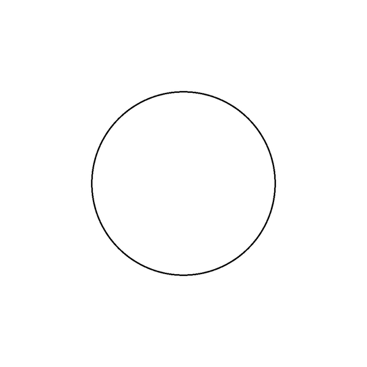
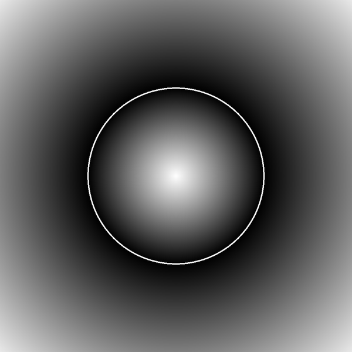
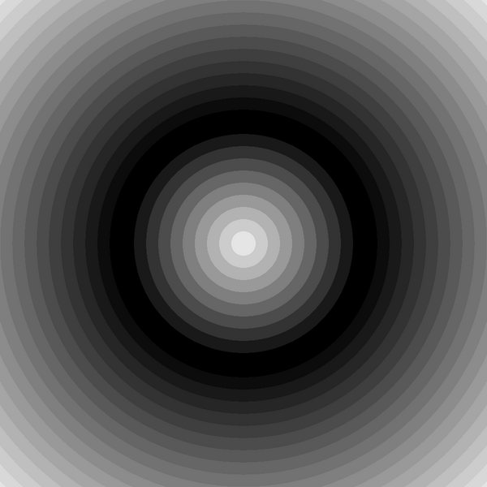
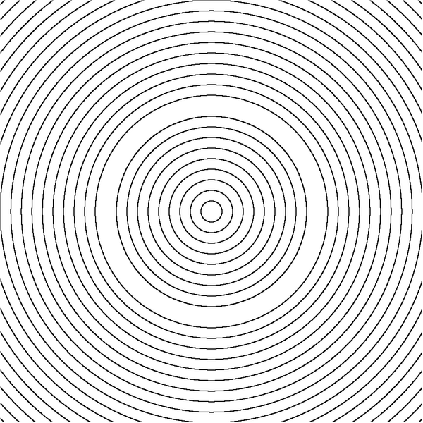
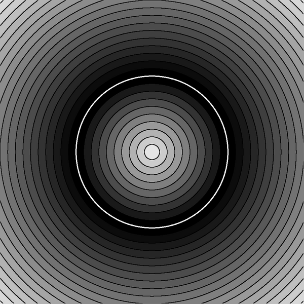
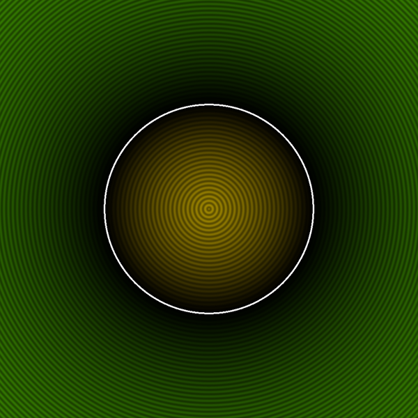

* [Disk - distance 2D in Shadertoy by IQ](https://www.shadertoy.com/view/3ltSW2) 
* [2D distance functions by Inigo Quilez]( https://iquilezles.org/articles/distfunctions2d/)
* [explanation : Shader Tutorial | Intro to Signed Distance Fields on YouTube by Suboptimal Engineer](https://www.youtube.com/watch?v=pEdlZ9W2Xs0) 
* [wikibooks](https://en.wikibooks.org/wiki/Fractals/Mathematics/Vector_field#SDF)


# Images

Test image = unit circle 
 
 

8 bit color 

Continous gradient 

 

 


Discrete gradient = Level Set Method ( LSM)

 

 

 

 

24 bit color

 


 

# source code 
* [d.c](./src/d.c) - c code = one file program
* [d.sh](./src/d.sh)- bash file
* [Makefile](./src/Makefile) - Makefile


To run the program

  make


Dependencies
* Gnu Make
* Image Magic convert
* Bash
* gcc

text output:

```
chmod +x d.sh
./d.sh
make pgm files 
run the compiled program
setup start
 end of setup 
compute image 
 999 from 999 
File circle_1000.pgm saved . Comment = unit circle  
compute image 
 999 from 999 
File circle_sdf_8bit_cont_1000.pgm saved . Comment = sdf for unit circle in 8 bit color 
compute image 
 999 from 999 
File circle_sdf_8bit_discrete_1000.pgm saved . Comment = sdf for unit circle in 8 bit discrete color = LSM 
File circle_sdf_8bit_discrete_LCM_1000.pgm saved . Comment = sdf for unit circle in 8 bit discrete color = LCM 
File circle_sdf_8bit_discrete_LSCM_1000.pgm saved . Comment = sdf for unit circle in 8 bit discrete color = LSCM 
draw 8 bit circle 
 999 from 999 
File circle_sdf_8bit_discrete_LSCM_with_circle_1000.pgm saved . Comment = sdf for unit circle in 8 bit discrete color (LSCM) with circle  
draw 8 bit circle 
 999 from 999 
File circle_sdf_8bit_cont_with_circle_1000.pgm saved . Comment = sdf for unit circle in 8 bit color and circle  
compute image 
 999 from 999 
File circle_sdf_24bit_1000.ppm saved . Comment =  sdf for unit circle in 24 bit color 
compute image 
 999 from 999 
File circle_sdf_24bit_white_1000.ppm saved . Comment =  sdf for unit circle in 24 bit colorwith white circle 
Program version = 20230409  
Image Width = 4.000000 in world coordinate
PixelWidth = 0.0040040040040040 
plane description 
	plane_center z =  0.0000000000000000 +0.0000000000000000*i  and plane_radius = 2.0000000000000000 
ratio of image  = 1.000000 ; it should be 1.000 ...
Unknown pixels = 0 = 0.0000000000000000 * iSize 
Exterior pixels = 0 = 0.0000000000000000 * iSize 
Interior pixels = 0 = 0.0000000000000000 * iSize 
sdf Max = 1.828427 	 sdf min = -0.997169
 allways free memory (deallocate )  to avoid memory leaks 
 warning: too long comment in Save8bitArray2PGMFile can cause: *** stack smashing detected ***: terminated
gcc version: 11.3.0
__STDC__ = 1
__STDC_VERSION__ = 201710
c dialect = C18

real	0m0.430s
user	0m0.426s
sys	0m0.004s
change Image Magic settings
convert all pgm files to png using Image Magic v 6 convert 
circle_1000.pgm
circle_sdf_8bit_cont_1000.pgm
circle_sdf_8bit_cont_with_circle_1000.pgm
circle_sdf_8bit_discrete_1000.pgm
circle_sdf_8bit_discrete_LCM_1000.pgm
circle_sdf_8bit_discrete_LSCM_1000.pgm
circle_sdf_8bit_discrete_LSCM_with_circle_1000.pgm
convert all ppm files to png using Image Magic v 6 convert 
circle_sdf_24bit_1000.ppm
circle_sdf_24bit_white_1000.ppm
delete all pgm and ppm files 
OK
info about software 
GNU bash, version 5.1.16(1)-release (x86_64-pc-linux-gnu)
Copyright (C) 2020 Free Software Foundation, Inc.
License GPLv3+: GNU GPL version 3 or later <http://gnu.org/licenses/gpl.html>

This is free software; you are free to change and redistribute it.
There is NO WARRANTY, to the extent permitted by law.
GNU Make 4.3
Built for x86_64-pc-linux-gnu
Copyright (C) 1988-2020 Free Software Foundation, Inc.
License GPLv3+: GNU GPL version 3 or later <http://gnu.org/licenses/gpl.html>
This is free software: you are free to change and redistribute it.
There is NO WARRANTY, to the extent permitted by law.
gcc (Ubuntu 11.3.0-1ubuntu1~22.04.1) 11.3.0
Copyright (C) 2021 Free Software Foundation, Inc.
This is free software; see the source for copying conditions.  There is NO
warranty; not even for MERCHANTABILITY or FITNESS FOR A PARTICULAR PURPOSE.

Version: ImageMagick 6.9.11-60 Q16 x86_64 2021-01-25 https://imagemagick.org
Copyright: (C) 1999-2021 ImageMagick Studio LLC
License: https://imagemagick.org/script/license.php
Features: Cipher DPC Modules OpenMP(4.5) 
Delegates (built-in): bzlib djvu fftw fontconfig freetype heic jbig jng jp2 jpeg lcms lqr ltdl lzma openexr pangocairo png tiff webp wmf x xml zlib
Resource limits:
  Width: 1MP
  Height: 1MP
  List length: unlimited
  Area: 128MP
  Memory: 256MiB
  Map: 512MiB
  Disk: 10GiB
  File: 768
  Thread: 8
  Throttle: 0
  Time: unlimited
```

# Star History

[


# Git

  git clone git@github.com:adammaj1/sdf.git


Subdirectory


```
mkdir png
git add *.png
git mv  *.png ./png
git commit -m "move"
git push -u origin main
```

to overwrite

  git mv -f 


then link the images:

    
