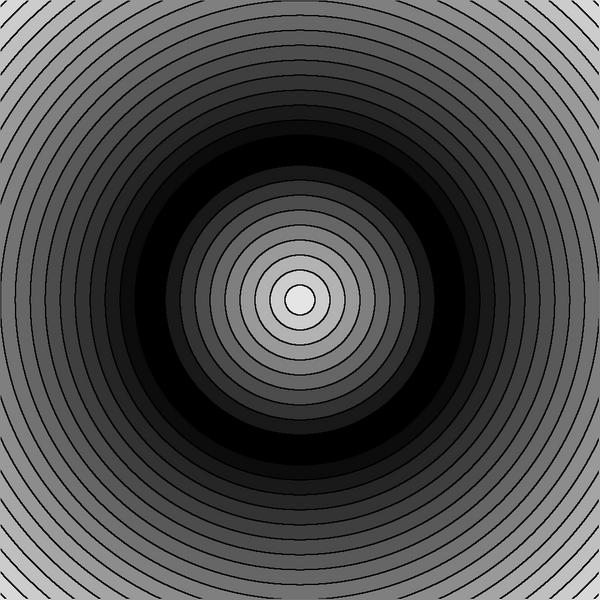

* [Disk - distance 2D in Shadertoy by IQ](https://www.shadertoy.com/view/3ltSW2) 
* [2D distance functions by Inigo Quilez]( https://iquilezles.org/articles/distfunctions2d/)
* [explanation : Shader Tutorial | Intro to Signed Distance Fields on YouTube by Suboptimal Engineer](https://www.youtube.com/watch?v=pEdlZ9W2Xs0) 
 


# Images

Test image = unit circle 
 
 

8 bit color 

Continous gradient 

 

 


Discrete gradient = Level Set Method ( LSM)

 

 

 

 

24 bit color

 


 

# source code 
* [d.c](./src/d.c) - c code = one file program
* [d.sh](./src/d.sh)- bash file
* [Makefile](./src/Makefile) - Makefile


To run the program

  make


Dependencies
* Gnu Make
* Image Magic convert
* Bash
* gcc


# Git


Subdirectory


```
mkdir png
git add *.png
git mv  *.png ./png
git commit -m "move"
git push -u origin main
```

then link the images:

    
